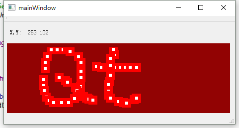
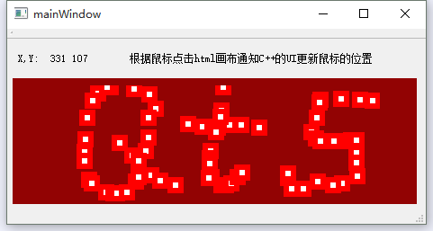

### QWebEngineView与Js交互实例

* QtQuick Website: http://www.heilqt.com





#### 描述

* QWebEngineView与Js交互实例，实现与js进行数据传输

* 功能:

* C++可以输送数据给网页JS进行处理后显示
* JS端可以将网页数据输出给C++来计算和处理
* 可以得到js函数的输出内容和C++返回值


#### 编译方法

* 下载QtJsWebEngine项目
* 打开QtCreator IDE
* 清理项目进行编译
* 点击运行

#### 使用方法

* 记得将网页内容的JavaScript文件导入
```
    <script type="text/javascript" src="qrc:///qtwebchannel/qwebchannel.js"></script>
    <script type="text/javascript">
```


## 贡献
* [QT WebEngineView Communication with Javascript](http://blog.trumpton.org.uk/2015/09/qt-webengineview-communication-with.html)
* [寒山-居士](https://github.com/toby20130333)
* [toby520](http://www.heilqt.com)
